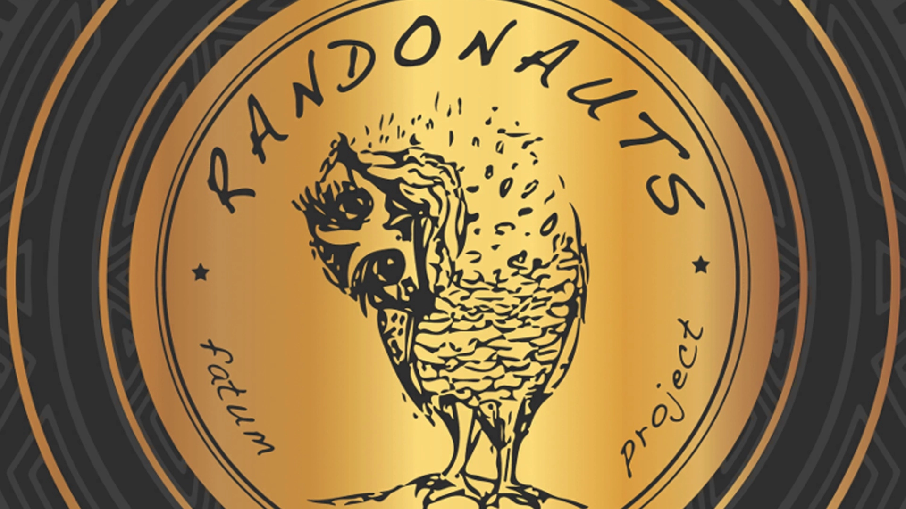

import data from "./data";

Some markdown plain text :rocket:

Example markdown:
$$
L = \frac{1}{2} \rho v^2 S C_L
$$

$$
a^2 + b^2 = c^2
$$

~~This statement is true?~~

**Some bold text**

*Some italicized text*

- [ ] Write the press release
- [ ] Update the website
- [ ] Contact the media

Some inline `code` should do the trick!

---

[title](https://example.com)



# Header 1
## Header 2
### Header 3
#### Header 4
##### Header 5
###### Header 6

- List one
- List two
- List three is a really long task that takes up a lot of space so therefore it needs to wrap to the next line

1. Task one
2. Task two
3. Task three

<Spoiler title="Hello">
Lorem ipsum dolor ipsut
</Spoiler>


<DataTable src={data}/>

[title](data)


```shell
dig

ls - a
```


<Quiz question="What does html stand for?" answer="TEST">
    <Option>TEST</Option>
    <Option>Hyper Text Markup Language</Option>
    <Option>IDK</Option>
    <Option>NOTHING</Option>
</Quiz>

```dockerfile
FROM ubuntu:latest
MAINTAINER support@website.com
RUN apt-get update
RUN apt-get install -y apache2
```


```cpp :title=hello
#include "VM.h"
#include <fstream>
#include "VM_binaries.h"

using namespace std;
using namespace VM_BINARIES;

int main(int argc, char const *argv[]) {
  cout <<< "HEllo world";
}

```

| Syntax | Description | Usage | Test |
| --- | --- | --- | --- |
| Header | Title | HTML is reall cool | Test |
| Paragraph | Text | nulkl | Test |
| Header | Title is also really cool! | HTML is reall cool | Test |
| Header | Title | HTML is reall cool |  [link](https://example.com) |
| Header | Title | HTML is reall cool |  `code` |

Run this `pip install flask, flask-cors`

```rust

/// The actual Blockchain container
#[derive(Debug, Clone)]
pub struct Blockchain {
    /// Stores all the blocks which are accepted already within the blockchain
    pub blocks: Vec<Block>,

    /// Lookup from AccountID (will be a public key later) to Account.
    /// Effectively, this represents the WorldState
    pub accounts: HashMap<String, Account>,

    /// Will store transactions which should be added to the chain
    /// but aren't yet
    pending_transactions: Vec<Transaction>
}
```
Thats all folks!


```diff
+ Hello world
- Text goes here 

```

```py
from itertools import combinations
#First sort the list from high to low
#Then loop from the list in reverse
def solution(l):
    l.sort(reverse=True)
    for i in reversed(range(1, len(l) + 1)):
        #Find combinations possible combinations
        for com in combinations(l, i):
            print(com)
            #If the sum of the potential combination is divisible by 3 
            #return its whole number concatenated
            if sum(com) % 3 == 0: 
                return int(''.join(map(str, com)))
    return 0 
    

def is_possible_to_make_divisible(arr): 
    # Find remainder of sum when divided by 3 
    remainder = 0
    for i in range (0, 3): 
        remainder = (remainder + arr[i]) % 3
    # Return true if remainder is 0. 
    return (remainder == 0)

def divisible(num):
    n = len(num)
    # add up all the digits of num 
    mysum = sum(num)
    # if num is already is  
    # divisible by 3 then no 
    # digits are to be removed 
    if (mysum % 3 == 0): 
        return 0
    # if there is single digit,  
    # then it is not possible  
    # to remove one digit. 
    if (n == 1): 
        return 0
    # traverse through the number  
    # and find out if any number  
    # on removal makes the sum  
    # divisible by 3 
    for i in range(n): 
        if (mysum % 3 == int(num[i]) % 3): 
            return 1
print(divisible([3, 1, 4, 1, 5, 9]))
```


```rust
pub fn find(&self, find_value: T) -> bool {
    match self {
        BST::Leaf {
            ref value,
            ref left,
            ref right,
        } => match find_value.cmp(value) {
            Ordering::Less => left.find(find_value),
            Ordering::Greater => right.find(find_value),
            Ordering::Equal => true,
        },
        BST::Empty => false,
    }
}


pub fn find(&self, find_value: T) -> bool {
    match self {
        BST::Leaf {
            ref value,
            ref left,
            ref right,
        } => match find_value.cmp(value) {
            Ordering::Less => left.find(find_value),
            Ordering::Greater => right.find(find_value),
            Ordering::Equal => true,
        },
        BST::Empty => false,
    }
}


pub fn find(&self, find_value: T) -> bool {
    match self {
        BST::Leaf {
            ref value,
            ref left,
            ref right,
        } => match find_value.cmp(value) {
            Ordering::Less => left.find(find_value),
            Ordering::Greater => right.find(find_value),
            Ordering::Equal => true,
        },
        BST::Empty => false,
    }
}


pub fn find(&self, find_value: T) -> bool {
    match self {
        BST::Leaf {
            ref value,
            ref left,
            ref right,
        } => match find_value.cmp(value) {
            Ordering::Less => left.find(find_value),
            Ordering::Greater => right.find(find_value),
            Ordering::Equal => true,
        },
        BST::Empty => false,
    }
}


pub fn find(&self, find_value: T) -> bool {
    match self {
        BST::Leaf {
            ref value,
            ref left,
            ref right,
        } => match find_value.cmp(value) {
            Ordering::Less => left.find(find_value),
            Ordering::Greater => right.find(find_value),
            Ordering::Equal => true,
        },
        BST::Empty => false,
    }
}


```


```tsx
import * as React from 'react';
import * as Prism from 'prismjs';
import cx from 'classnames';
import getLoader from 'prismjs/dependencies';
import components from 'prismjs/components'; //JS not the folder
import './codeblock.scss';
import './prism.scss';
import { Icon } from '../ui/icon/icon';

const languagesToLoad: string[] = [
    "markup",
    "python",
    "go",
    "regex",
    "arduino",
    "javascript",
    "css",
    "php",
    "cpp",
    "c",
    "nasm",
    "java",
    "rust",
    "typescript",
    "crystal",
    "jsx",
    "tsx",
    "json",
    "graphql",
    "bash",
    "shell",
    "cs",
    "dotnet",
    "cmake",
    "docker",
    "dockerfile",
    "fortran",
    "gitignore",
    "npmignore",
    "makefile",
    "matlab",
    "nginx",
    "objc",
    "php",
    "powershell",
    "puppet",
    "regex",
    "scss",
    "sql",
    "toml",
    "typescript",
    "wasm",
    "yaml"
];

const pluginsToLoad: string[] = [
    "line-numbers",
    "match-braces",
    "highlight-keywords",
    "file-highlight",
];

export const CodeBlock = (props: any) => {
    const codeRef = React.useRef<HTMLPreElement>(null);
    const language = props.className.split("language-").join("");
    
    React.useEffect(() => {
        //Not the cleanest solution but loadLanguages is broken
        const languageLoader = getLoader(components, languagesToLoad);
        const pluginLoader = getLoader(components, pluginsToLoad);
        languageLoader.load((language:string) => {
            require(`prismjs/components/prism-${language || `clike`}.min.js`);
        });
        pluginLoader.load((plugin: string) => {
            require(`prismjs/plugins/${plugin}/prism-${plugin}.min.js`);
        });
        Prism.highlightAll();
    });

    function copyCode() {
        if (codeRef.current) {
            navigator.clipboard.writeText(codeRef.current.innerText);
        }
    }

    return (
        <section style={{ margin: "1em 0 1em 0" }}>
            <ul className="tool__bar">
                <li>
                    <Icon height={26} width={26} name={language}/>
                </li>
                <li
                    className="copy__icon"
                    onClick={copyCode}
                >
                    <Icon name="copy" height={26} width={26}/>
                </li>
                
            </ul>
            <pre style={{
                margin: 0,
                borderBottomLeftRadius: "10px",
                borderBottomRightRadius: "10px",
            }} className={cx("code__block", "match-braces", "line-numbers")}>
                <code ref={codeRef} className={cx(props.className, "rainbow-braces")}>
                    {props.children}
                </code>
            </pre>
            
        </section>
    );
}


export const InlineCode = ({ children }: any) => {
    return (
        <code className="inline">{children}</code>
    )
}
```


```c
/** C implementation for  
    Red-Black Tree Insertion 
    This code is provided by  
    costheta_z **/
#include <stdio.h> 
#include <stdlib.h> 
  
// Structure to represent each  
// node in a red-black tree 
struct node { 
    int d; // data 
    int c; // 1-red, 0-black 
    struct node* p; // parent 
    struct node* r; // right-child 
    struct node* l; // left child 
}; 
  
// global root for the entire tree 
struct node* root = NULL; 
  
// function to perform BST insertion of a node 
struct node* bst(struct node* trav,  
                      struct node* temp) 
{ 
    // If the tree is empty,  
    // return a new node 
    if (trav == NULL) 
        return temp; 
  
    // Otherwise recur down the tree 
    if (temp->d < trav->d)  
    { 
        trav->l = bst(trav->l, temp); 
        trav->l->p = trav; 
    } 
    else if (temp->d > trav->d)  
    { 
        trav->r = bst(trav->r, temp); 
        trav->r->p = trav; 
    } 
  
    // Return the (unchanged) node pointer 
    return trav; 
} 
  
// Function performing right rotation  
// of the passed node 
void rightrotate(struct node* temp) 
{ 
    struct node* left = temp->l; 
    temp->l = left->r; 
    if (temp->l) 
        temp->l->p = temp; 
    left->p = temp->p; 
    if (!temp->p) 
        root = left; 
    else if (temp == temp->p->l) 
        temp->p->l = left; 
    else
        temp->p->r = left; 
    left->r = temp; 
    temp->p = left; 
} 
  
// Function performing left rotation  
// of the passed node 
void leftrotate(struct node* temp) 
{ 
    struct node* right = temp->r; 
    temp->r = right->l; 
    if (temp->r) 
        temp->r->p = temp; 
    right->p = temp->p; 
    if (!temp->p) 
        root = right; 
    else if (temp == temp->p->l) 
        temp->p->l = right; 
    else
        temp->p->r = right; 
    right->l = temp; 
    temp->p = right; 
} 
  
// This function fixes violations  
// caused by BST insertion 
void fixup(struct node* root, struct node* pt) 
{ 
    struct node* parent_pt = NULL; 
    struct node* grand_parent_pt = NULL; 
  
    while ((pt != root) && (pt->c != 0) 
           && (pt->p->c == 1))  
    { 
        parent_pt = pt->p; 
        grand_parent_pt = pt->p->p; 
  
        /*  Case : A 
             Parent of pt is left child  
             of Grand-parent of 
           pt */
        if (parent_pt == grand_parent_pt->l)  
        { 
  
            struct node* uncle_pt = grand_parent_pt->r; 
  
            /* Case : 1 
                The uncle of pt is also red 
                Only Recoloring required */
            if (uncle_pt != NULL && uncle_pt->c == 1)  
            { 
                grand_parent_pt->c = 1; 
                parent_pt->c = 0; 
                uncle_pt->c = 0; 
                pt = grand_parent_pt; 
            } 
  
            else { 
  
                /* Case : 2 
                     pt is right child of its parent 
                     Left-rotation required */
                if (pt == parent_pt->r) { 
                    leftrotate(parent_pt); 
                    pt = parent_pt; 
                    parent_pt = pt->p; 
                } 
  
                /* Case : 3 
                     pt is left child of its parent 
                     Right-rotation required */
                rightrotate(grand_parent_pt); 
                int t = parent_pt->c; 
                parent_pt->c = grand_parent_pt->c; 
                grand_parent_pt->c = t; 
                pt = parent_pt; 
            } 
        } 
  
        /* Case : B 
             Parent of pt is right  
             child of Grand-parent of 
           pt */
        else { 
            struct node* uncle_pt = grand_parent_pt->l; 
  
            /*  Case : 1 
                The uncle of pt is also red 
                Only Recoloring required */
            if ((uncle_pt != NULL) && (uncle_pt->c == 1))  
            { 
                grand_parent_pt->c = 1; 
                parent_pt->c = 0; 
                uncle_pt->c = 0; 
                pt = grand_parent_pt; 
            } 
            else { 
                /* Case : 2 
                   pt is left child of its parent 
                   Right-rotation required */
                if (pt == parent_pt->l) { 
                    rightrotate(parent_pt); 
                    pt = parent_pt; 
                    parent_pt = pt->p; 
                } 
  
                /* Case : 3 
                     pt is right child of its parent 
                     Left-rotation required */
                leftrotate(grand_parent_pt); 
                int t = parent_pt->c; 
                parent_pt->c = grand_parent_pt->c; 
                grand_parent_pt->c = t; 
                pt = parent_pt; 
            } 
        } 
    } 
  
    root->c = 0; 
} 
  
// Function to print inorder traversal  
// of the fixated tree 
void inorder(struct node* trav) 
{ 
    if (trav == NULL) 
        return; 
    inorder(trav->l); 
    printf("%d ", trav->d); 
    inorder(trav->r); 
} 
  
// driver code 
int main() 
{ 
    int n = 7; 
    int a[7] = { 7, 6, 5, 4, 3, 2, 1 }; 
  
    for (int i = 0; i < n; i++) { 
  
        // allocating memory to the node and initializing: 
        // 1. color as red 
        // 2. parent, left and right pointers as NULL 
        // 3. data as i-th value in the array 
        struct node* temp 
            = (struct node*)malloc(sizeof(struct node)); 
        temp->r = NULL; 
        temp->l = NULL; 
        temp->p = NULL; 
        temp->d = a[i]; 
        temp->c = 1; 
  
        // calling function that performs bst insertion of 
        // this newly created node 
        root = bst(root, temp); 
  
        // calling function to preserve properties of rb 
        // tree 
        fixup(root, temp); 
    } 
  
    printf("Inoder Traversal of Created Tree\n"); 
    inorder(root); 
  
    return 0; 
}

```